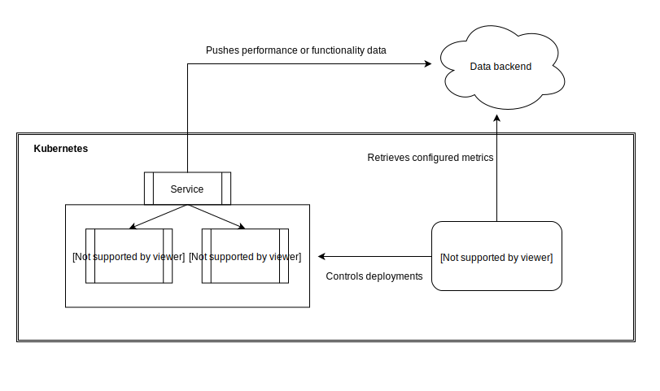
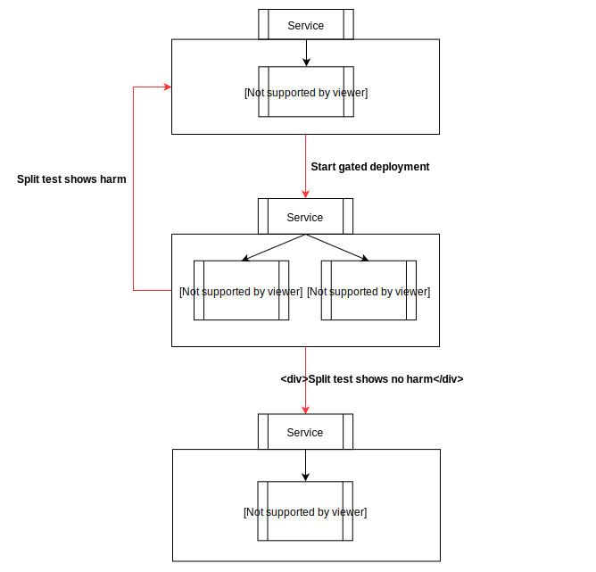

# Kubernetes Gated Deployments

Kubernetes Gated Deployments facilitates A/B tests on application deployments to
perform automated regression testing and canary analysis.



Kubernetes Gated Deployments extends the Kubernetes API to add a new type of
object called `GatedDeployments`, that allows engineers to specify which
deployments and decision plugins to include in the A/B test. It uses a
controller in the Kubernetes control plane that is responsible for implementing
this behavior by retrieving and analyzing metrics from the backend specified,
decisioning the A/B test, and either rolling back or continuing the deployment.

## How it works



1. A `GatedDeployment` object is added to the cluster (see the section for
   [Installing the controller](#installing-the-controller))
1. The controller fetches `GatedDeployment` objects using the Kubernetes API
1. When the `treatment` deployment specified in the `GatedDeployment` object is
   deployed and eligible for an A/B test, i.e., it has more than zero replicas
   and a different pod spec than the `control` deployment, the controller will
   start the experiment
1. The controller will poll the decision plugins and determine if the
   `treatment` deployment is causing harm to the metrics measured
1. The controller will either roll back the `treatment` deployment (by setting
   the number of replicas to zero), or promote the `treatment` deployment by
   setting the `control` deployment's image to that of the `treatment`
   deployment, followed by scaling the `treatment` deployment down to zero
   replicas

## Usage

### Installing the controller

#### Using `kubectl`

To create the `GatedDeployment` controller on an existing Kubernetes cluster,
run the following:

```sh
kubectl apply -f gated-deployments.yml
```

This creates all the necessary resources and deploys the controller in the
`kubernetes-gated-deployments` namespace.

#### Using Helm

Alternatively, Helm can be used to install and manage the resources and
controller. To install, run the following:

```sh
helm install helm/kubernetes-gated-deployments --name kubernetes-gated-deployments
```

See the [Developing](#developing) section for running locally during
development.

### Create `control` and `treatment` deployments

Create two identical deployments with different names (e.g.,
`example-rest-service-control` and `example-rest-service-treatment`). Initially,
the number of replicas for the treatment deployment must be set to 0 and control
deployment will be the only one taking production traffic.

Example deployment manifests are available [here](./examples).

NOTE: The names of the deployments cannot be a prefix of the other. The gated
deployment controller uses the deployment name as the host prefix (since pod
names are of the form `<deployment name>-<xxxxx>` and if one deployment name is
the prefix of the other, it will include data from all the pods. For example,
using `example-rest-service` for control and `example-rest-service-treatment`
for treatment will result in control including the data for treatment as well.

### Configure the gated deployment

Create an
[`example-rest-service-gated-deployment.yml`](./examples/example-rest-service-gated-deployment.yml)
file like below:

```yml
apiVersion: 'kubernetes-client.io/v1'
kind: GatedDeployment
metadata:
  name: example-rest-service
deploymentDescriptor:
  control:
    name: example-rest-service-control
  treatment:
    name: example-rest-service-treatment
  decisionPlugins:
    - name: newRelicPerformance
      accountId: 807783
      secretName: newrelic-secrets
      secretKey: example-rest-service
      appName: example-rest-service
      minSamples: 50
      maxTime: 600
      testPath: /shopper/products
```

Save the file and run:

```sh
kubectl apply -f example-rest-service-gated-deployment.yml
```

In the example above, the `GatedDeployment` object specifies that we want to
gate our deployments on the performance of the `/shopper/products` path, between
the `example-rest-service-control` deployment and
`example-rest-service-treatment` deployment (the latter of which we deploy new
changes to). In this case, we specify that we want the controller to use the
`newRelicPerformance` decision plugin to analyze performance data, which will be
retrieved from New Relic (which our application is instrumented with).

For this plugin, you will also need to create a secret containing the NewRelic
API key; an example is shown below. In this case, `newRelic.secretName` is set
to `newrelic-secrets`, and `newRelic.secretKey` is set to
`example-rest-service`. This means that the controller will look in its deployed
namespace for a secret called `newrelic-secrets`, and look in the secret data
for the value corresponding to the key `example-rest-service`.

```yml
apiVersion: v1
kind: Secret
metadata:
  name: newrelic-secrets
type: Opaque
data:
  example-rest-service: aW5zaWdodHNBcGlLZXk=
```

Within the `deploymentDescriptor` section of the `GatedDeployment` object, these
are the possible options to customize. All options are required unless
explicitly specified as optional.

|Property|Description|
|---|---|
|`control`|Section describing the control deployment.|
|`control.name`|Name of the control deployment.|
|`treatment`|Section describing the treatment deployment. This should be the one normally deployed, e.g. as part of your CICD pipeline.|
|`treatment.name`|Name of the treatment deployment.|
|`decisionPlugins`|Section containing the list of decision plugin config objects. See [Plugin configurations](#plugin-configurations) below for details on specific plugins.|

### Plugin configurations

Each type of plugin will require its own configuration. The following parameters
are common to all plugins:

|Property|Description|
|---|---|
|`name`|The plugin name. This allows the plugin factory to find the correct plugin class.|
|`maxTime` (optional)|The maximum amount of time the experiment will run, at which point the A/B test will stop and automatically roll out the treatment deployment to the control deployment. When not specified, this defaults to 600 seconds (10 minutes)|

Plugins are designed to return one of three values:
* `WAIT`: if the analysis cannot make a conclusion about the metric yet, e.g.,
  it requires a minimum amount of time or if the result is not yet statistically
  significant
* `PASS`: if the treatment version does no harm to the metric analyzed
* `FAIL`: if the treatment does harm to the metric analyzed

#### New Relic performance plugin

|Property|Description|
|---|---|
|`name`|Must be `newRelicPerformance`|
|`accountId`|Account ID of the New Relic account integrated with your application.|
|`secretName`|Name of the secret where your New Relic API keys can be found. This should be created in the namespace where `kubernetes-gated-deployments` is deployed.|
|`secretKey`|Name of the key in the secret specified in `secretName` that contains the New Relic Insights API key, used to run NRQL to collect performance data.|
|`appName`|Name of the New Relic application.|
|`testPath`|Path that you want to measure performance of for both deployments.|
|`minSamples`|The minimum number of samples required for each deployment before testing for significance.|
|`zScoreThreshold` (optional)|The Z Score threshold for Mann-Whitney U test. Defaults to 1.96, which corresponds to a p-value of 0.05|
|`harmThreshold` (optional)|Maximum allowable ratio of treatment to control U values from the Mann-Whitney U Test before treatment is marked as causing harm. This defaults to 1.5.|

### Contributing plugins

To contribute a new plugin, create a new plugins class in [lib/plugins](lib/plugins) that is a subclass of [`Plugin`](lib/plugins/plugin.js). At minimum, you should implement the following methods:
* `build`: this should create the plugin with any necessary setup
* `_poll`: this is called periodically, and it should fetch and analyze metrics to return a `DecisionResult`

The following methods are implemented by default:
* `onExperimentStart`: this is called when the experiment starts, and sets the experiment start time
* `onExperimentStop`: this is called when an experiment ends, and clears the experiment start time
* `onExperimentPoll`: this is called on every polling interval; it will check if the maximum experiment duration has been reached and return `PASS` if it has, or it will return the result from `_poll`.

### Rolling out new versions

To roll out a new version, update the treatment deployment with the new image
and set the number of replicas to a non zero value (depending on the percentage
of traffic you want to send to the new version).

Once the treatment deploy is rolled out, the gated deployment controller will
start a new experiment and start polling for decisions from the decision
plugins. The experiment runs until either all plugins have returned `PASS`, or
any single plugin returns `FAIL`, at which point the controller will set the
`gatedDeployStatus` annotation on the treatment deployment to either `noHarm` or
`harm` respectively.

An example command to get the value of the annotation

```sh
kubectl get deploy -o jsonpath='{.metadata.annotations.gatedDeployStatus}' example-rest-service-treatment
```

This value can be periodically polled to check if the new version is causing
harm or not in the CI/CD pipeline of the application. If the deployment causes
no harm, the controller automatically rolls it out the new version to the
control deployment. The status of the rollout can be checked using the below
command.

```sh
kubectl rollout status deploy/example-rest-service-control
```

## Developing

See [CONTRIBUTING.md](CONTRIBUTING.md) for how to contribute to this project.

You can develop locally with
[Minikube](https://kubernetes.io/docs/setup/minikube/).

On Linux, the `kvm2` driver provides better performance than the default
`virtualbox` driver, but either will work:

```
minikube start --vm-driver=kvm2
```

`minikube start` will configure your `kubeconfig` for your local Minikube
cluster and set the current context to be for Minikube. With that configuration
you can run the `kubernetes-gated-deployment` controller on your host operating
system:

```
npm start
```

## License

Kubernetes Gated Deployments is [MIT licensed](LICENSE).

## Authors

* Steven Fu
* Satish Ravi
* Jacob Brooks
* Silas Boyd-Wickizer